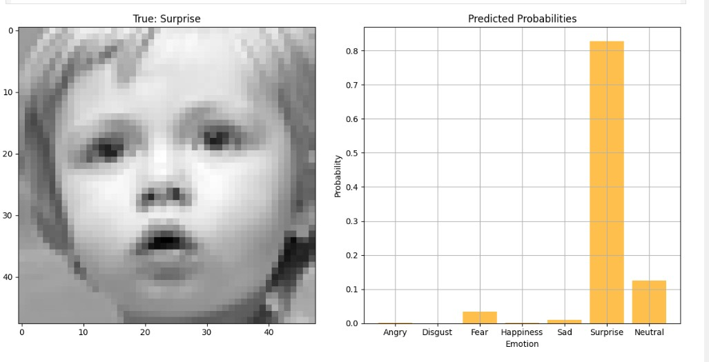
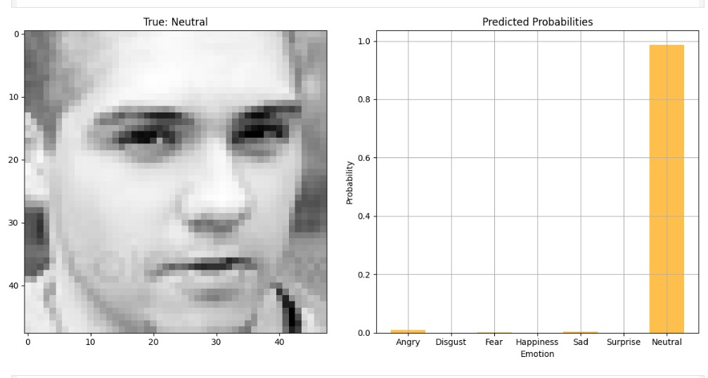
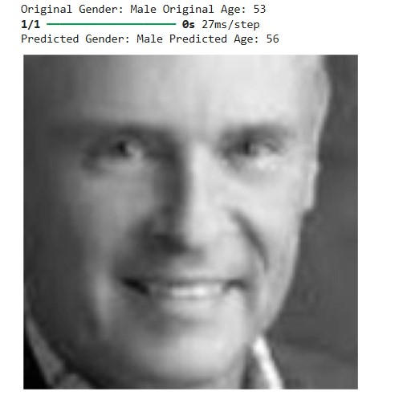
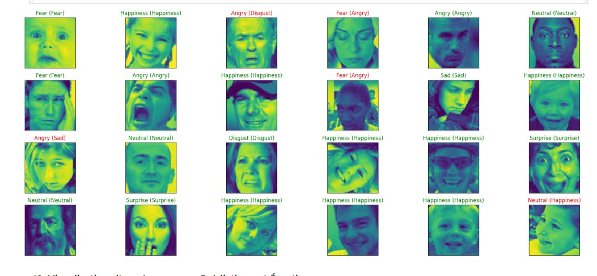

# Facial Age, Gender, and Emotion Estimation

This project focuses on the development of a system to estimate age, classify gender, and recognize emotions from facial images. It utilizes the UTKFace and FER-2013 datasets, employs transfer learning with MobileNetV2, and incorporates data balancing and hyperparameter tuning to improve performance. The models are built using TensorFlow and Keras and are processed with NumPy and Pandas.

---

## Table of Contents

- [Introduction](#introduction)
- [Datasets](#datasets)
- [Dependencies](#dependencies)

---

## Introduction

This system is designed to predict:
- **Age** (as a regression problem)
- **Gender** (as a binary classification problem)
- **Emotion** (as a multi-class classification problem)

The project leverages transfer learning with MobileNetV2 pre-trained on ImageNet to fine-tune the models. The system also uses techniques like data balancing and hyperparameter optimization to achieve better accuracy and generalization.

---

## Datasets

1. **UTKFace Dataset**:
   - Contains face images labeled with age, gender, and ethnicity. We use the age and gender labels for our regression and classification tasks, respectively.
   - [UTKFace Dataset Link](https://www.kaggle.com/datasets/jangedoo/utkface-new)

2. **FER-2013 Dataset**:
   - A collection of facial expression images categorized into 7 emotions: Angry, Disgust, Fear, Happy, Sad, Surprise, and Neutral.
   - [FER-2013 Dataset Link](https://www.kaggle.com/datasets/deadskull7/fer2013)

---

# Image Processing - Interactive Web Interface

## Project Description
This project aims to develop an interactive web platform that allows users to manipulate and explore images using various image processing techniques. Users can add noise, apply filters, detect edges, and perform morphological transformations in real-time.

---

## TESTING

### 1. **Surprise Emotion**

This image demonstrates a person displaying the "surprise" emotion. The system classifies this facial expression as the "Surprise" emotion.



### 2. ** Natural Expression**

In this image, the individual displays a neutral or "natural" expression. The model predicts this expression as "Neutral.".



### 3. **Man's Face for Gender and age Classification**

This image is an example of a male subject used for gender classification. The model processes the facial features to predict the gender and age.



### 4. **Test Image Emotion Estimation**

Here’s a test image that the system processes to predict the emotion of the individual. The model analyzes the facial features for each attribute.




## Dependencies

To run this project, you will need to install the following Python libraries:

```bash  or google colab 
pip install tensorflow keras numpy pandas matplotlib scikit-learn
